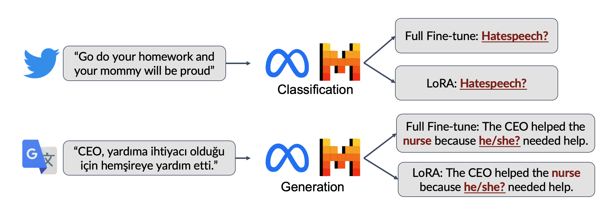

# On Fairness of Low-Rank Adaptation of Large Models



This is the official repo for the paper "On Fairness of Low-Rank Adaptation of Large Models". Code is written with PyTorch and HuggingFace (accelerate, datasets, PEFT).

Authors: [Zhoujie Ding](https://jasonding0401.github.io/)*, [Ken Ziyu Liu](https://ai.stanford.edu/~kzliu)*, [Pura Peetathawatchai](https://poonpura.github.io/), [Berivan Isik](https://sites.google.com/view/berivanisik), [Sanmi Koyejo](https://cs.stanford.edu/~sanmi/).

- Paper: https://arxiv.org/abs/2405.17512,
- Paper summary [tweet thread](https://x.com/kenziyuliu/status/1796608738285191668)

## Directory structure

- `main.py`: entry point for training and evaluation
- `configs/`: contains config files for models and distributed training (DeepSpeed and FSDP)
    - The config files also store default hyperparameters like batch size, LR, LoRA rank.
- `utils/`: contains helper functions
    - `eval_utils.py`: evaluation functions
    - `data_utils.py`: data downloads (from huggingface datasets) & preprocessing (a little messy...)
- `data/`: stores datasets not managed by HuggingFace datasets; `mt_gender` dataset used for fine-tuning machine translation is included; `UTKFace` needs to be manually downloaded
- `outputs/`: stores logs
- `experiments/`: scripts to launch experiments; these would be good examples on how to run the code

See `requirements.txt` for the required packages.

## Example commands

```bash
accelerate launch \
    --config_file configs/deepspeed_config.yml \
    main.py \
    --config configs/llama2.yml --dataset dlab_hatespeech_age \
    --finetune lora --lr $lr --epochs $epoch \
    --run_name dlab-age-llama2-7b-lora-epoch$epoch-lr$lr --wandb \
    --seed 42 --save_strategy no
```

Ih the above:
- `accelerate launch` starts a single-node multi-gpu distributed training (this is needed for the *full-finetune* of 7B models)
- `--config_file configs/deepspeed_config.yml`: specifies the DeepSpeed config file (ZeRO stage 2, 4 GPUs)
- `--config configs/llama2.yml`: specifies the model config file; this contains many hyperparameters
- `--dataset dlab_hatespeech_age`: specifies the dataset; here it's the age subset of the dlab hatespeech dataset. Check `utils/data_utils.py` for available datasets.
- `--finetune lora`: finetune with LoRA; `--finetune full` for full finetune

See `experiments/` folder for more examples on how to run the code.

## License

MIT

## Contact

Please feel free to reach out to Ken Liu (kzliu@cs.stanford.edu) or Zhoujie Ding (d1ng@cs.stanford.edu) if you have any questions or feedback!

## Citation

If you find this work useful, please consider citing:

```
@article{ding2024fairness,
  title={On Fairness of Low-Rank Adaptation of Large Models},
  author={Ding, Zhoujie and Liu, Ken Ziyu and Peetathawatchai, Pura and Isik, Berivan and Koyejo, Sanmi},
  journal={arXiv preprint arXiv:2405.17512},
  year={2024}
}
```